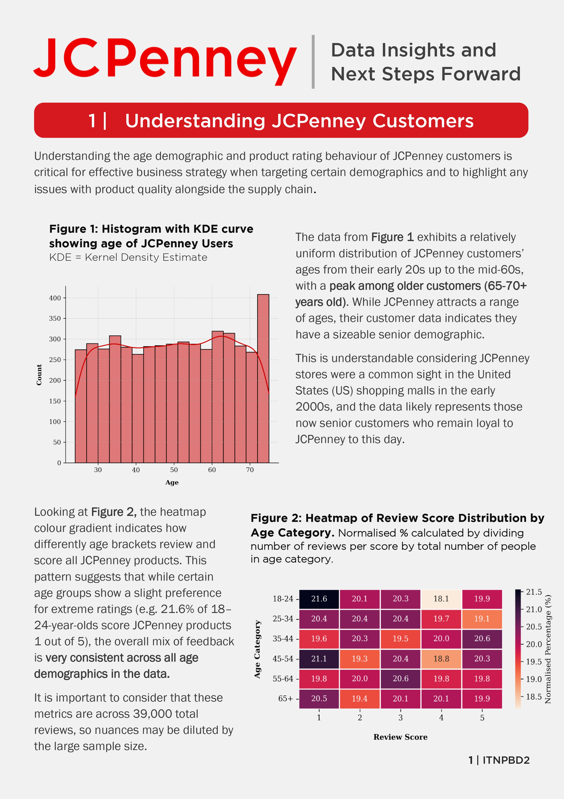
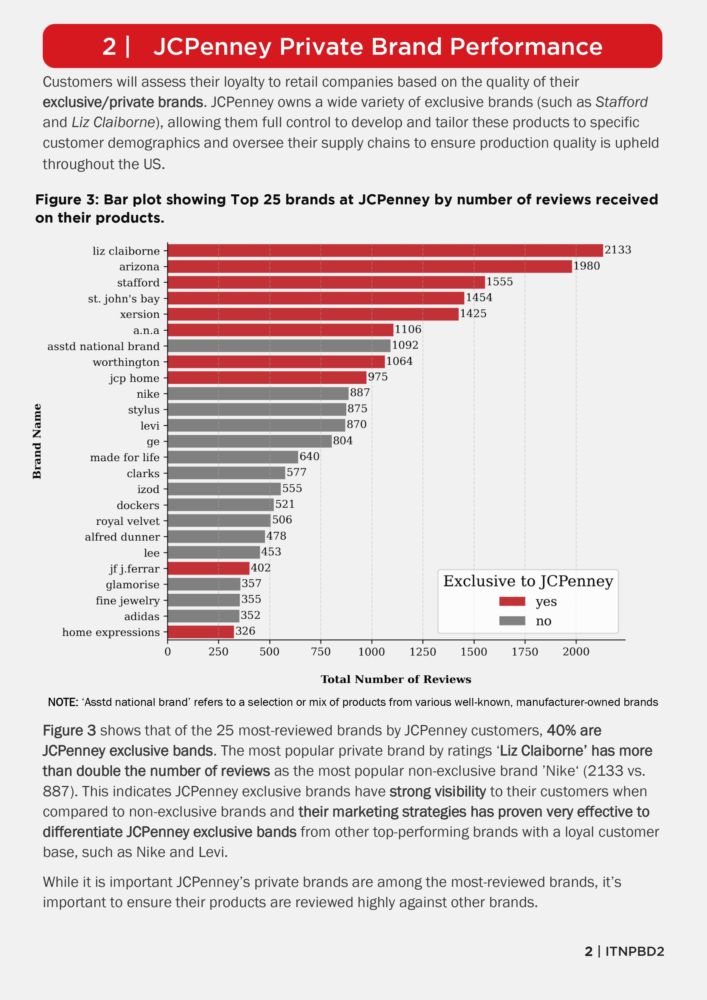
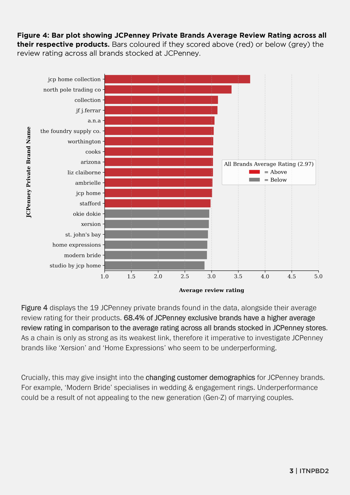
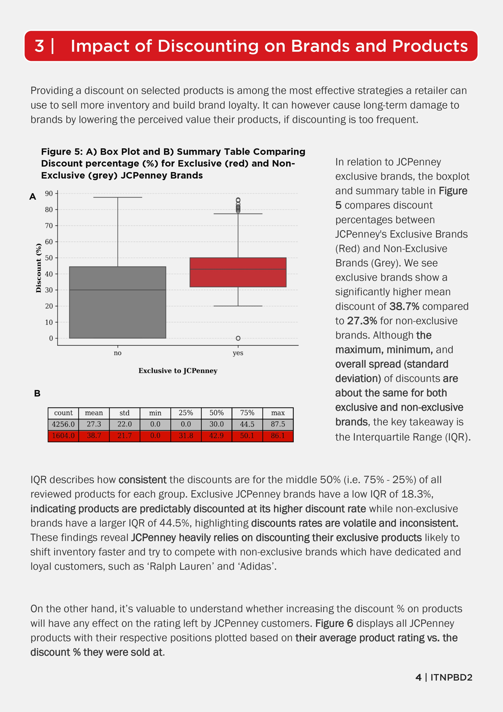
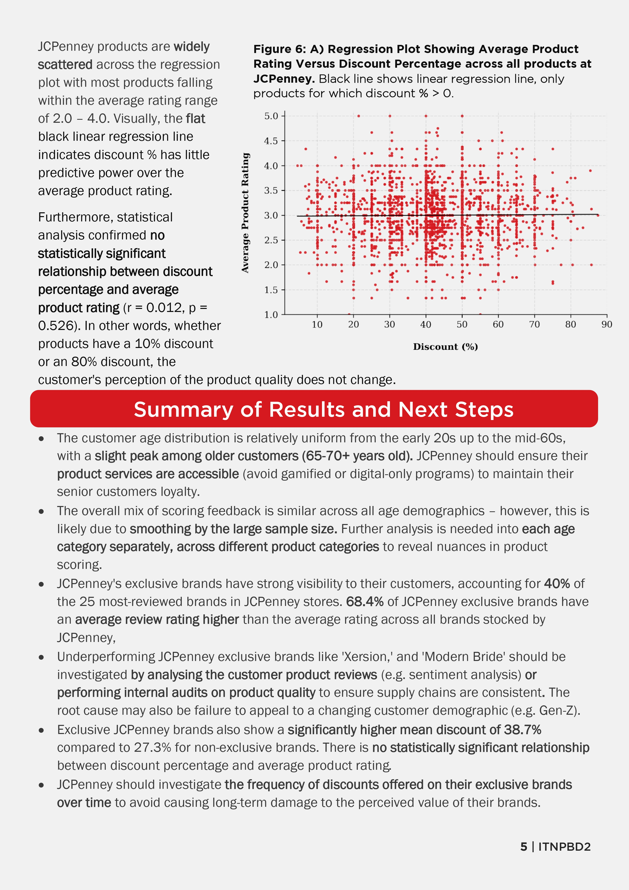
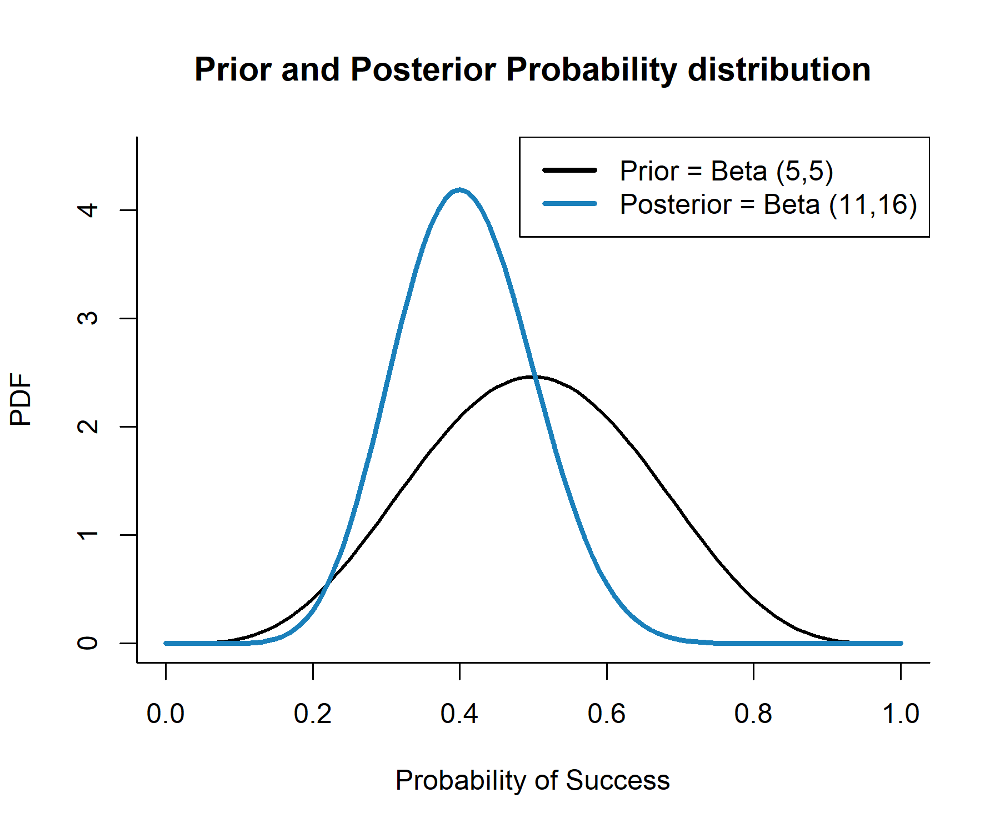

Hello! 

My name is Darragh Coyle. I'm an aspiring data engineer currently studying MSc in Big Data at University of Stirling. This page is used to display past projects I've completed so feel free to have a look!

You can find me on: [LinkedIn](https://www.linkedin.com/in/darragh-coyle/) [Github](https://github.com/dara86)

***

## Interactive Dashboard of Scottish Property Prices

**Link:** [Dashboard](https://scottish-housing-dashboard.streamlit.app) + [Source Code](https://github.com/dara86/scottish-housing-dashboard)

**Goal:** To create an ETL pipeline of UK government data and build an interactive dashboard designed to analyse and visualise Scottish property prices

***

## Business Insights for Retail Company JCPenney

**Link:** [Report + Source Code(.pdf)](./jcp_report.pdf)

**Goal:** To showcase ability to understand and manipulate raw data and present insights so non-technical audiences can understand the findings

  
<strong>Click HERE to view 5-page report</strong>

   

  
  
  
  
  

***

***

## Man vs. Keyboard: Statistical Analysis of My Typing Ability 

**Link:** [Report + Source Code(.pdf)](./the_stats_report.pdf)

**Goal:** Take data from day-to-day life and use statistical techniques to get deeper insights into how I approach the task of self-improvement 

Using <https://www.typingtest.com>, collected 30 observations over 4 weeks.

* **Variables:**
    * **Performance:** WPM (Words Per Minute), Accuracy (%).
    * **Test Conditions:** Test length (1 vs. 3 minutes), Test difficulty (Easy vs. Hard). 
    * **Environment:** Caffeine (Y/N), Music (Y/N), Time of Day, Location (Home, Library, Cafe).
      
 

**Statistics Used:** Linear regression, Welch's t-test, Chi-Squared test, Fisher's Exact Test, Bayes's Theorem 

 

### Statistics Preview

| Question | Statistical Test | | 
| :--- | :--- | :---| 
| **Does practice make perfect?** | `Linear Regression` | 
| **Does music help me focus?** | `Bayesian Inference` | 
| **Does coffee increase accuracy?** | `Welchs t-test` | 

